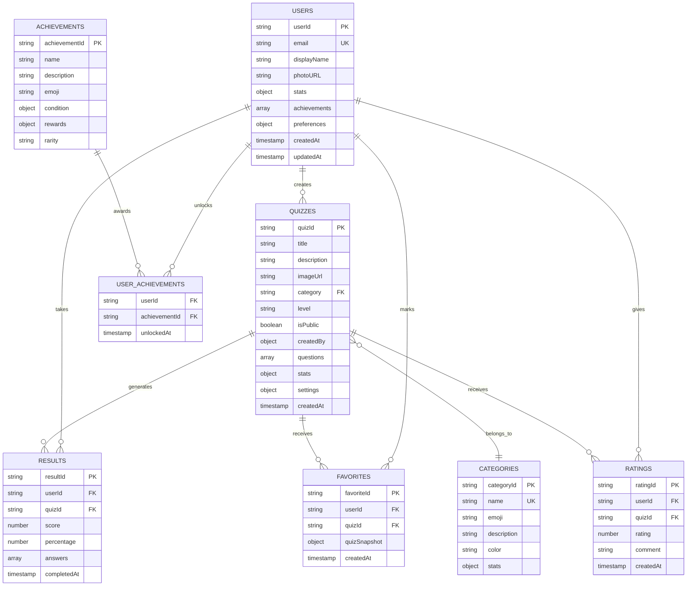
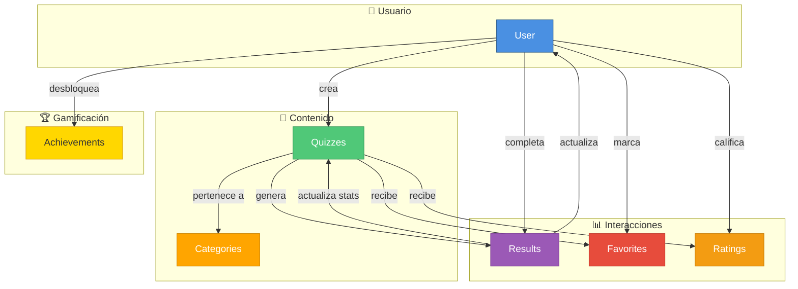
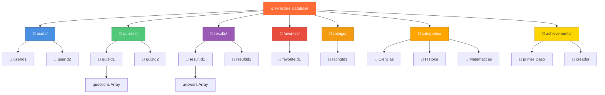
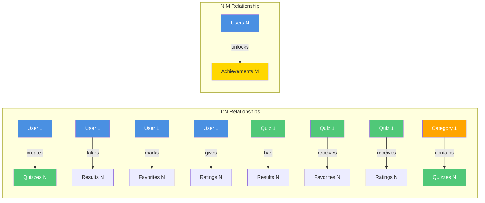
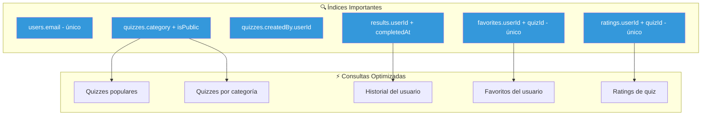

# 📊 Diagrama del Modelo de Base de Datos - QuizPro Learning

## 🎨 Diagrama ER (Entity-Relationship) en Mermaid

### Diagrama Completo con Relaciones



---

## 🔄 Diagrama de Flujo de Datos Simplificado



---

## 🗂️ Estructura de Colecciones (Árbol)



---

## 📐 Diagrama de Cardinalidad



---

## 🎯 Índices y Optimizaciones



---

## 🛠️ Herramientas para Crear Diagramas Profesionales

### 1. **draw.io (diagrams.net)** ⭐ RECOMENDADO
- **URL**: https://app.diagrams.net/
- **Ventajas**:
  - ✅ Gratis y open source
  - ✅ No requiere registro
  - ✅ Exporta a PNG, SVG, PDF
  - ✅ Integración con Google Drive, OneDrive
  - ✅ Plantillas de ER y base de datos
- **Cómo usarlo**:
  1. Ve a https://app.diagrams.net/
  2. Selecciona "Create New Diagram"
  3. Escoge plantilla "Entity Relation" o "Software"
  4. Arrastra y suelta entidades
  5. Exporta como imagen

### 2. **Lucidchart**
- **URL**: https://www.lucidchart.com/
- **Ventajas**:
  - ✅ Muy profesional y pulido
  - ✅ Colaboración en tiempo real
  - ✅ Plantillas específicas para bases de datos
  - ⚠️ Requiere cuenta (tiene plan gratuito limitado)

### 3. **dbdiagram.io**
- **URL**: https://dbdiagram.io/
- **Ventajas**:
  - ✅ Especializado en bases de datos
  - ✅ Código declarativo (escribes texto, genera diagrama)
  - ✅ Exporta a PNG, PDF, SQL
  - ✅ Gratis para uso básico
- **Ejemplo de código**:
```dbml
Table users {
  userId varchar [pk]
  email varchar [unique]
  displayName varchar
  createdAt timestamp
}

Table quizzes {
  quizId varchar [pk]
  title varchar
  category varchar [ref: > categories.categoryId]
  createdBy varchar [ref: > users.userId]
}

Table categories {
  categoryId varchar [pk]
  name varchar [unique]
}
```

### 4. **Mermaid Live Editor**
- **URL**: https://mermaid.live/
- **Ventajas**:
  - ✅ Gratis, sin registro
  - ✅ Preview en tiempo real
  - ✅ Exporta a PNG, SVG
  - ✅ Funciona en GitHub, VSCode, Notion
- **Cómo usarlo**:
  1. Copia el código Mermaid de arriba
  2. Pégalo en https://mermaid.live/
  3. Descarga como imagen

### 5. **Visual Studio Code con extensiones**
- **Extensiones recomendadas**:
  - `Mermaid Preview` - Preview de diagramas Mermaid
  - `Draw.io Integration` - draw.io dentro de VSCode
  - `PlantUML` - Otro formato de diagramas
- **Ventajas**:
  - ✅ Todo dentro del editor
  - ✅ Control de versiones con Git
  - ✅ Markdown + diagramas en un solo lugar

### 6. **Excalidraw**
- **URL**: https://excalidraw.com/
- **Ventajas**:
  - ✅ Estilo dibujado a mano (muy visual)
  - ✅ Gratis, sin registro
  - ✅ Colaboración en tiempo real
  - ✅ Exporta a PNG, SVG
  - ✅ Muy intuitivo

---

## 📝 Instrucciones Rápidas para draw.io

### Paso a Paso:

1. **Abre draw.io**: https://app.diagrams.net/
2. **Selecciona ubicación**: "Device" o "Google Drive"
3. **Escoge plantilla**: "Entity Relation" o "Blank Diagram"
4. **Crea las entidades**:
   - Busca "Rectangle" o "Entity" en la barra lateral
   - Arrastra 7 rectángulos (una por colección)
   - Nómbralos: users, quizzes, results, etc.
5. **Agrega atributos**:
   - Doble clic en cada entidad
   - Lista los campos principales
6. **Conecta las relaciones**:
   - Usa flechas para conectar
   - Etiqueta las relaciones: "creates", "takes", etc.
7. **Estiliza**:
   - Colores diferentes por tipo
   - Agrega iconos/emojis
8. **Exporta**:
   - File → Export as → PNG/SVG/PDF

---

## 🎨 Código para dbdiagram.io

Copia y pega esto en https://dbdiagram.io/:

```dbml
Table users {
  userId varchar [pk]
  email varchar [unique]
  displayName varchar
  photoURL varchar
  stats json
  achievements json_array
  preferences json
  createdAt timestamp
  updatedAt timestamp
}

Table quizzes {
  quizId varchar [pk]
  title varchar
  description text
  imageUrl varchar
  category varchar [ref: > categories.categoryId]
  level varchar
  isPublic boolean
  createdBy_userId varchar [ref: > users.userId]
  questions json_array
  stats json
  settings json
  createdAt timestamp
  updatedAt timestamp
}

Table results {
  resultId varchar [pk]
  userId varchar [ref: > users.userId]
  quizId varchar [ref: > quizzes.quizId]
  score int
  percentage float
  correctAnswers int
  answers json_array
  completedAt timestamp
  createdAt timestamp
}

Table favorites {
  favoriteId varchar [pk]
  userId varchar [ref: > users.userId]
  quizId varchar [ref: > quizzes.quizId]
  quizSnapshot json
  createdAt timestamp

  Indexes {
    (userId, quizId) [unique]
  }
}

Table ratings {
  ratingId varchar [pk]
  userId varchar [ref: > users.userId]
  quizId varchar [ref: > quizzes.quizId]
  rating int
  comment text
  createdAt timestamp
  updatedAt timestamp

  Indexes {
    (userId, quizId) [unique]
  }
}

Table categories {
  categoryId varchar [pk]
  name varchar [unique]
  emoji varchar
  description text
  color varchar
  stats json
  isActive boolean
  order int
}

Table achievements {
  achievementId varchar [pk]
  name varchar
  description text
  emoji varchar
  condition json
  rewards json
  rarity varchar
  order int
}
```

---

## 📊 Resumen Visual de Colecciones

```
┌─────────────────────────────────────────────────────────┐
│                   🗄️ FIRESTORE DATABASE                 │
└─────────────────────────────────────────────────────────┘
                             │
        ┌────────────────────┼────────────────────┐
        │                    │                    │
    ┌───▼───┐           ┌────▼────┐         ┌────▼────┐
    │ USERS │           │ QUIZZES │         │CATEGORIES│
    │  (1)  │           │   (N)   │         │   (8)   │
    └───┬───┘           └────┬────┘         └─────────┘
        │                    │
        │    ┌───────────────┼───────────────┐
        │    │               │               │
    ┌───▼────▼───┐      ┌────▼────┐    ┌────▼────┐
    │  RESULTS   │      │FAVORITES│    │ RATINGS │
    │    (N)     │      │   (N)   │    │   (N)   │
    └────────────┘      └─────────┘    └─────────┘
        │
    ┌───▼──────────┐
    │ ACHIEVEMENTS │
    │     (15)     │
    └──────────────┘

Leyenda:
(1)  = Pocos documentos
(N)  = Muchos documentos
(8)  = Cantidad fija
```

---

## 💡 Recomendación Final

**Para la demo del lunes**, te recomiendo:

1. **Usa Mermaid** en el README.md para documentación técnica
2. **Crea un diagrama en draw.io** para la presentación visual (más profesional)
3. **Exporta como PNG** para incluir en documentos o presentaciones

¿Quieres que te ayude a crear el diagrama en alguna herramienta específica o prefieres que ahora creemos los datos de demostración?
